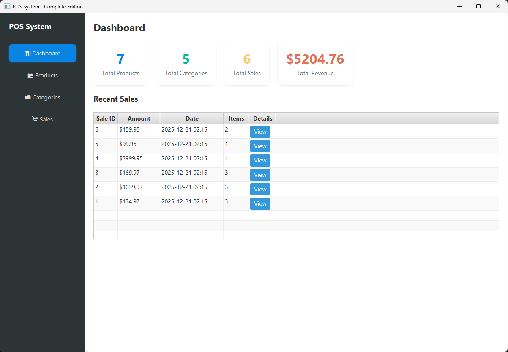
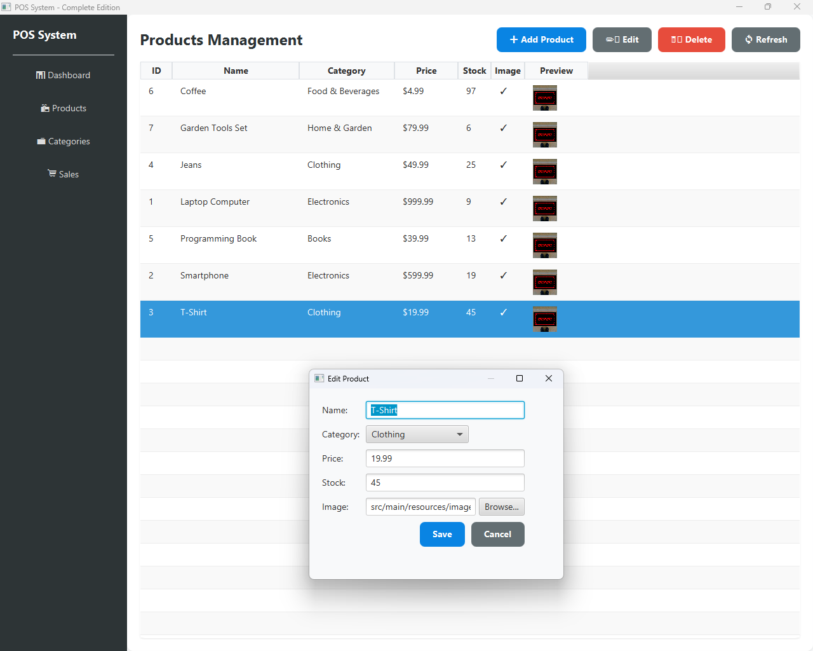
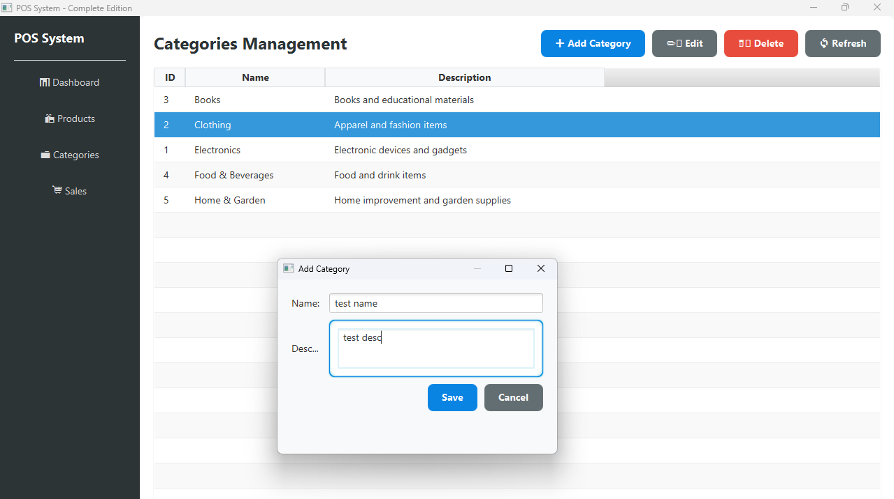
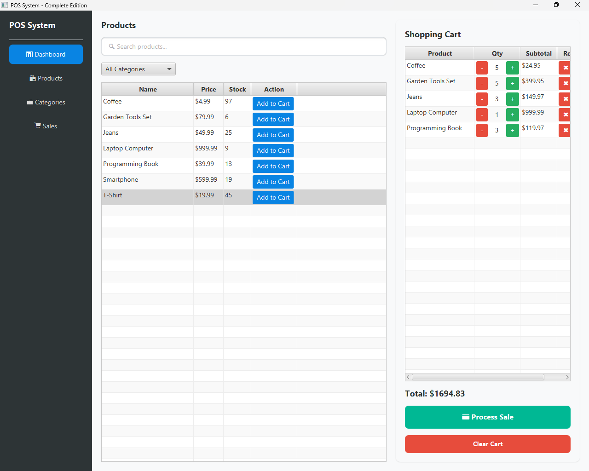
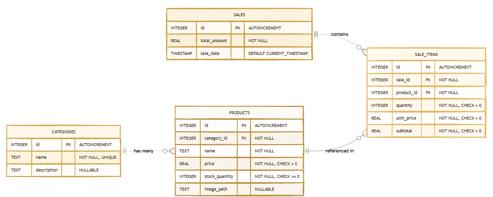
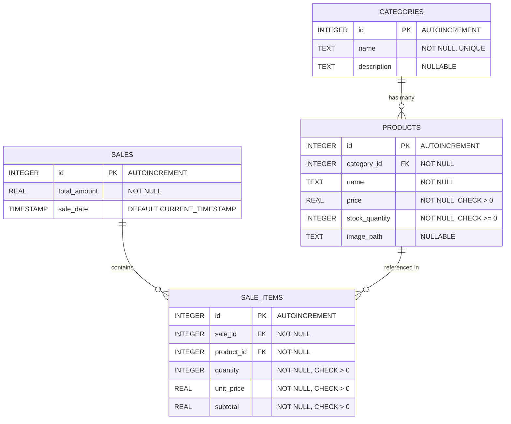
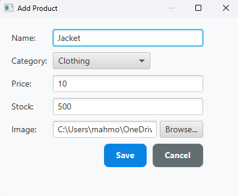

# 📋 Comprehensive System Analysis
## Point of Sale (POS) System

---

## 1. System Name

**Point of Sale (POS) System**  
*Java POS - Retail Management System*

---

## 1.1 Team Information

### Team Name
**Nextbyte**

### Team Members

| Name                               | ID      | Class |
| ---------------------------------- | ------- | ----- |
| Mahmoud Hisham Mahmoud (LD)        | 2320591 | 3     |
| Mohamed Mostafa Abdelmonem Youssef | 2320555 | 2     |
| Ahmed Khairy Farouk                | 2320800 | 4     |
| Mahmoud Abdullah                   | 2320581 | 3     |
| Karim Abdeljawad Abdel-Saleh Mansi | 2320446 | 3     |


---

## 2. System Aim & Services

### Primary Objectives

The POS System provides a comprehensive retail management solution for small to medium-sized businesses, focusing on:

1. **Streamline Sales Operations**: Quick transaction processing with real-time cart management
2. **Inventory Management**: Accurate product catalogs with categories, pricing, stock levels, and images
3. **Business Intelligence**: Real-time dashboard analytics (products, categories, sales, revenue)
4. **Data Organization**: Systematic product categorization for easy navigation
5. **Stock Control**: Automatic inventory tracking and updates after sales

### Services Offered

**Dashboard**: Real-time statistics (products, categories, sales count, revenue), recent sales history (last 10 transactions)

**Product Management**: Complete CRUD operations, image upload (PNG, JPG, JPEG, GIF), product details tracking, search & filtering

**Category Management**: Category creation/maintenance, product-category relationships, protected deletion

**Sales Processing**: Shopping cart system, real-time price calculation, stock validation, transaction recording, automated stock updates

---

## 3. Brief Overview of the System

The Point of Sale (POS) System is a desktop application built with JavaFX and SQLite, serving as a complete retail management solution for small to medium businesses.



*Figure 2: Main application interface showing the sidebar navigation and content area*

### Core Functionality

The system integrates four essential modules:

1. **Dashboard Module**: Central control center with key business metrics and transaction history via color-coded statistics cards

2. **Products Module**: Full product management with image upload, category assignment, price/stock management, displayed in sortable tables



*Figure 3: Products management interface with product table, add/edit/delete functionality, and image upload*

3. **Categories Module**: Hierarchical organization system with full CRUD operations and deletion protection



*Figure 4: Categories management interface with category table and CRUD operations*

4. **Sales Module**: Complete checkout workflow with product search, category filtering, cart management, stock validation, and automated transaction processing



*Figure 5: Sales interface showing product catalog, shopping cart, and checkout functionality*

### Technical Foundation

Built on **MVC (Model-View-Controller) architecture** with SQLite for lightweight, file-based data storage requiring no server setup.

---

## 4. Database Diagram

### 4.1 Entity Relationship Diagram



*Figure 1: Complete database structure showing all tables, relationships, and key constraints*

<!-- 
#### Detailed Mermaid Diagram Specification:


-->

### 4.2 Database Tables

**CATEGORIES**: `id` (PK), `name` (UNIQUE), `description`

**PRODUCTS**: `id` (PK), `category_id` (FK), `name`, `price` (CHECK > 0), `stock_quantity` (CHECK >= 0), `image_path`

**SALES**: `id` (PK), `total_amount`, `sale_date` (TIMESTAMP DEFAULT CURRENT_TIMESTAMP)

**SALE_ITEMS**: `id` (PK), `sale_id` (FK), `product_id` (FK), `quantity` (CHECK > 0), `unit_price` (CHECK > 0), `subtotal` (CHECK > 0)

### 4.3 Relationships

1. **Categories → Products (1:N)**: One category has many products; FK: `products.category_id` → `categories.id`

2. **Sales → Sale Items (1:N)**: One sale contains many items; FK: `sale_items.sale_id` → `sales.id`

3. **Products → Sale Items (1:N)**: One product appears in many sale items; FK: `sale_items.product_id` → `products.id`

### 4.4 Data Integrity

- **Referential Integrity**: Foreign keys ensure data consistency
- **Check Constraints**: Prices and quantities must be positive/non-negative
- **Unique Constraints**: Category names must be unique
- **NOT NULL Constraints**: Critical fields enforced at database level

<!-- 
#### Textual ER Diagram Representation:

```
┌─────────────────────────┐
│      CATEGORIES         │
├─────────────────────────┤
│ PK │ id (INTEGER)       │
│    │ name (TEXT)        │ ──┐
│    │ description (TEXT) │   │
└─────────────────────────┘   │
                              │ (1:N)
                              │ Foreign Key
                              │
┌─────────────────────────┐   │
│       PRODUCTS          │   │
├─────────────────────────┤   │
│ PK │ id (INTEGER)       │   │
│ FK │ category_id (INT)  │ ──┘
│    │ name (TEXT)        │ ──┐
│    │ price (REAL)       │   │
│    │ stock_quantity     │   │
│    │ image_path (TEXT)  │   │
└─────────────────────────┘   │
                              │ (1:N)
                              │ Foreign Key
                              │
┌─────────────────────────┐   │
│        SALES            │   │
├─────────────────────────┤   │
│ PK │ id (INTEGER)       │   │
│    │ total_amount       │   │
│    │ sale_date          │   │
└─────────────────────────┘   │
                              │ (1:N)
                              │ Foreign Key
                              │
┌─────────────────────────┐   │
│      SALE_ITEMS         │   │
├─────────────────────────┤   │
│ PK │ id (INTEGER)       │   │
│ FK │ sale_id (INT)      │ ──┘
│ FK │ product_id (INT)   │ ──┐
│    │ quantity (INT)     │   │
│    │ unit_price (REAL)  │   │
│    │ subtotal (REAL)    │   │
└─────────────────────────┘   │
                              │
                              │ (N:1)
                              │ References Product
```
-->

---

## 5. Additional Elements

### 5.1 User Roles

**Current System**: Single-user model with full administrative access to all modules (Dashboard, Products, Categories, Sales)

**Future Enhancements**: User authentication, role-based access control (Manager, Cashier, Inventory Clerk), permission-based features, audit logging

### 5.2 Security Measures

**Data Validation**: Input validation for prices (> 0), stock (>= 0), quantities (> 0), required fields. Business logic validation for stock availability and category deletion protection.

**Database Security**: SQL injection prevention via prepared statements, transaction integrity, foreign key constraints for referential integrity.

**Application Security**: Comprehensive error handling, user-friendly error messages, SQLite file-based storage with automatic transaction management.

**Production Considerations**: Database encryption, user authentication, audit logging (not currently implemented)

### 5.3 System Architecture

**MVC Pattern**: Separation of View (JavaFX UI), Controller (event handlers), Model (data models + repositories), Database (SQLite via JDBC)

**Technology Stack**: Java 22, JavaFX 22, SQLite, SQLite JDBC, CSS styling, Batch build system

**Package Structure**: `com.pos/` with `models/`, `repository/`, `database/`, `controllers/`, `utils/` packages

**Data Flow**: User Action → UI Event → Controller → Repository → Database → UI Feedback

### 5.4 Deployment & Scalability

**Deployment**: Standalone desktop application, single-tier architecture, file-based SQLite, batch file execution, JRE 22 + JavaFX 22 required

**Current Capacity**: Suitable for small-medium retail, SQLite supports up to 140 TB, handles thousands of products/transactions

**Limitations**: Single-user access, no network/remote access, no concurrent multi-user support

**Future Options**: PostgreSQL/MySQL migration, client-server architecture, cloud deployment, mobile app integration

### 5.5 System Features Summary

| Module | Key Features |
|--------|-------------|
| **Dashboard** | Statistics cards, Recent sales, Real-time updates |
| **Products** | CRUD, Image upload, Search, Category filter |
| **Categories** | CRUD, Protected deletion, Description management |
| **Sales** | Shopping cart, Stock validation, Auto-calculations, Transaction recording |
| **Data Management** | Auto DB initialization, Sample data seeding, Persistence |



*Figure 6: Product add/edit dialog showing form fields for product details and image selection*

### 5.6 Limitations & Enhancements

**Current Limitations**: No user auth, single-user only, basic reporting, no barcode scanning, no receipt printing, no customer/supplier management, no backup utilities, no data export

**Suggested Enhancements**: User management system, advanced reporting/analytics, barcode integration, receipt printing, customer/supplier management, multi-store support, cloud sync, automated backups, data export (CSV/Excel)

---

## 6. Summary

The Point of Sale (POS) System is a **complete, functional retail management solution** integrating inventory management, sales processing, and business analytics into a single desktop application.

### Key Strengths
✅ Complete CRUD functionality across all modules  
✅ Modern, intuitive user interface  
✅ Robust data validation and error handling  
✅ Automated stock management  
✅ Real-time business metrics  
✅ Clean MVC architecture for maintainability  
✅ Zero-configuration deployment  

### Technical Excellence
- Well-structured codebase following best practices
- Efficient database design with proper relationships/constraints
- Comprehensive error handling for stability
- Extensible architecture ready for future enhancements

The system serves as an excellent foundation for retail operations and demonstrates professional-grade software development practices.

---